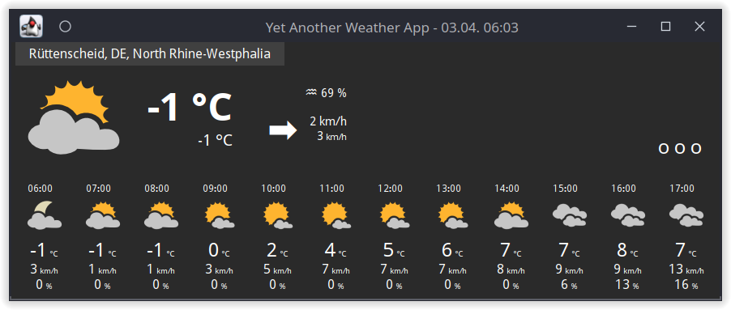
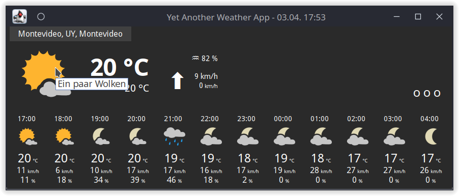
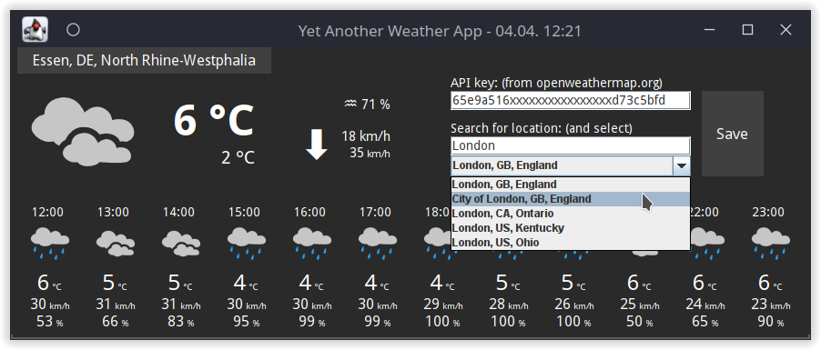

# Yet Another Weather App
#### Yet another clean looking weather app for Linux, Windows & MacOS

---

You can [download the jar-archive here](https://github.com/art1sec/Yawa/raw/master/Yawa.jar).

You need an API key from [Openweathermap.org](https://openweathermap.org/). If you don't have an account there yet, you can [sign up here](https://home.openweathermap.org/users/sign_up) for free to generate your API key for 1.000 free API calls per day.

If you don't want to signup with openweathermap.org and just want to take a short look on this app, feel free to send me an email to art1sec at msitc.de to receive a temporary key that I'll register for you.

If you make use of Yawa regualarly and/or extensivly, PLEASE get an API key on your own. It's totally free for 1.000 API calls per day!

Have fun!

|    |    |
|----|----|
|  |  |

---

(c) 2022 art1sec at msitc.de